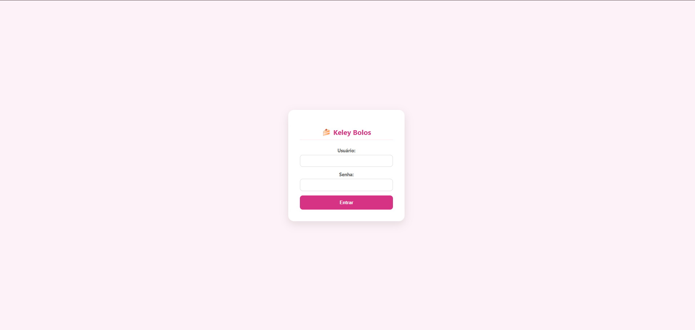
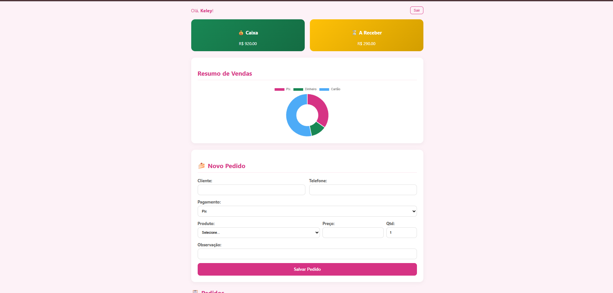
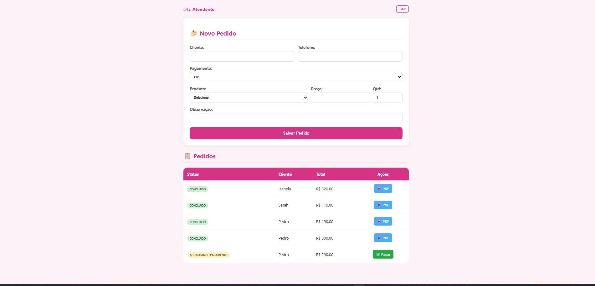
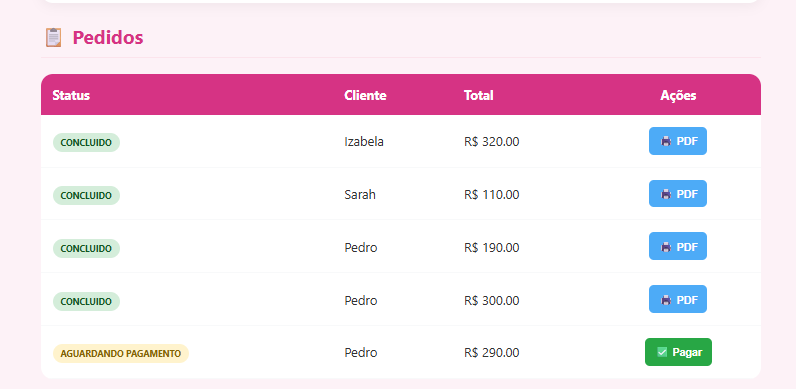
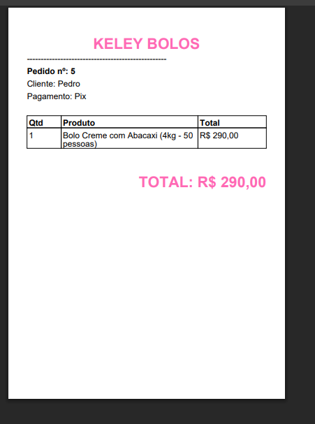

# 🍰 Keley Bolos API

Sistema web com backend desenvolvido como projeto de estudo e portfólio, simulando um sistema real para gerenciamento de pedidos e dados da loja Keley Bolos.

O objetivo do projeto é praticar Java + Spring Boot, integração com banco de dados, autenticação de usuários, geração de documentos e deploy em produção.

-----
## 🌐 Aplicação em produção

A API está publicada e rodando em produção:

👉 Keley Bolos API

🚀 Tecnologias utilizadas

Backend: Java 17, Spring Boot 3, Spring Data JPA, Hibernate

Banco de dados: PostgreSQL / H2 (ambiente de teste)

Build & Deploy: Maven, Docker, Railway

Documentação & Testes: Postman

 ------
## 🗄️ Banco de dados

PostgreSQL em ambiente cloud

Configuração via variáveis de ambiente

Criação automática das tabelas com hibernate.ddl-auto=update

Uso de H2 para testes e demonstração

-----

## 🔐 Segurança

Nenhuma senha ou credencial sensível é versionada no repositório.
As configurações utilizam variáveis de ambiente:

SPRING_DATASOURCE_URL

DATABASE_USERNAME

DATABASE_PASSWORD

-----

## ✨ Atualização do Sistema (Última Versão)

O sistema evoluiu de uma API simples para uma aplicação com fluxo completo de operação da loja.

## 🔐 Autenticação de Usuários

Tela de login integrada ao sistema

Controle de acesso por perfil:

Dona da loja → acesso ao painel financeiro

Funcionário → acesso operacional de pedidos

  

------
## 📊 Painel Administrativo — Área da Dona

Dashboard com visualização de desempenho financeiro da loja.
Funcionalidades:

Total de vendas

Valores em caixa

Valores a receber

Gráfico de faturamento por forma de pagamento: Pix, Cartão, Dinheiro

Os dados exibidos são fictícios para demonstração.

  

-----
## 📦 Gestão de Pedidos — Área Operacional

Módulo operacional para funcionários.
Funcionalidades:

Cadastro de novos pedidos

Listagem de pedidos realizados

Controle de status de pagamento

Visualização de pedidos a entregar

   

-----
## 🧾 Geração de Comprovante em PDF

Após a confirmação do pagamento, o sistema gera automaticamente um comprovante em PDF contendo os dados do pedido.

  

------
## ✅ Atualizações Recentes

Adicionado endpoint para atualização de status de pedidos em tempo real

Melhorias na validação de dados do backend para evitar erros de entrada

Ajuste no layout de respostas da API para maior padronização

Correção de bugs de autenticação e sessão de usuários

Otimização de queries para maior performance no PostgreSQL

Testes adicionais realizados com H2 para garantir consistência do sistema

-----

## ▶️ Como rodar o projeto localmente

Clone o repositório

Configure as variáveis de ambiente do banco

Execute o projeto:

mvn spring-boot:run

A aplicação irá subir por padrão na porta 8080.

-----

## 📚 Aprendizados

Estruturação de API REST com Spring Boot

Integração com banco de dados relacional

Autenticação e controle de acesso

Geração de documentos PDF

Deploy de aplicação backend em produção

Debug e resolução de erros reais de infraestrutura

Organização de projeto para portfólio profissional

-----
## ‍💻👩‍💻 Autora:

Izabela Xavier
Estudante de Análise e Desenvolvimento de Sistemas
Backend | Java | Spring Boot