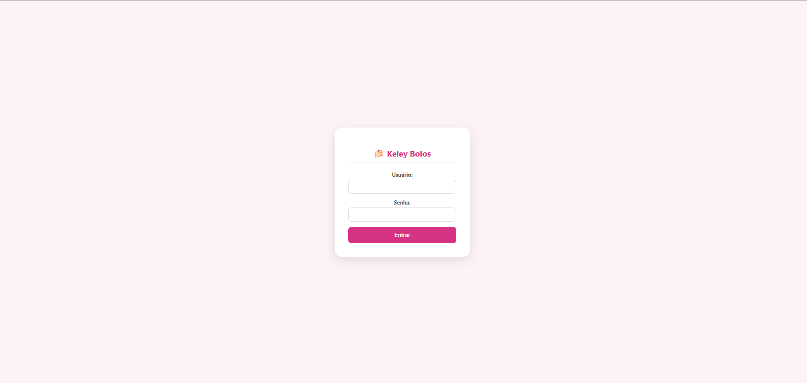
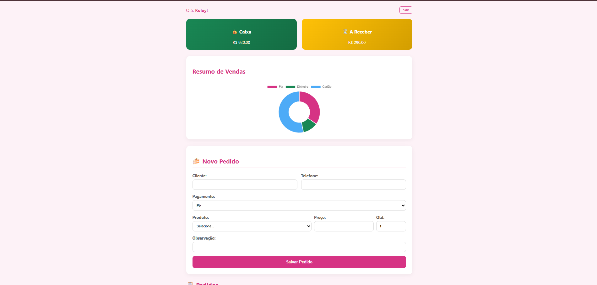
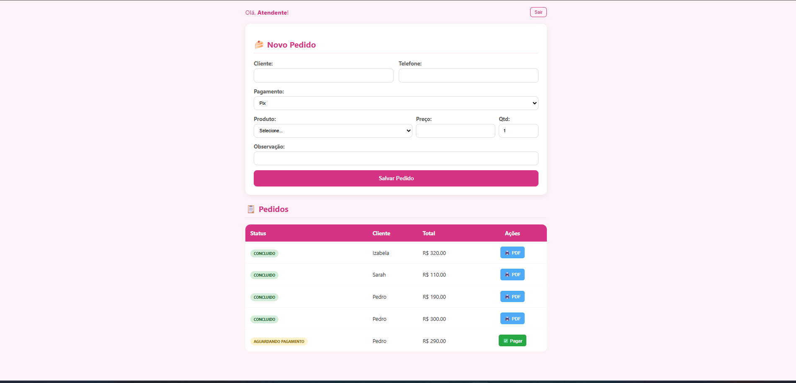
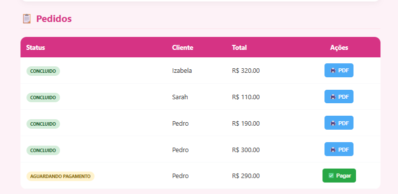
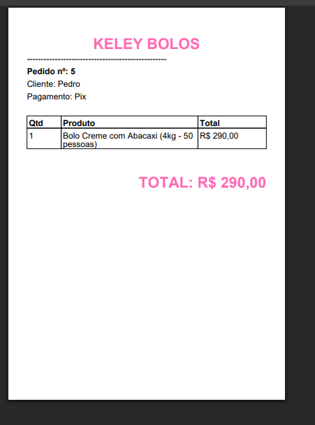

# 🍰 Keley Bolos API

<p align="center">
  
  
  
  
  
</p>

> **Status do Projeto:** Em produção 🚀

Sistema web fullstack desenvolvido para a confeitaria Keley Bolos, 
negócio real da minha família. O objetivo foi digitalizar a operação 
da loja, substituindo controles manuais por um sistema com gestão 
de pedidos, painel financeiro e geração automática de comprovantes.

---

## 🌐 Demonstração
A API está publicada e rodando em produção:
👉 [Acesse a Keley Bolos API](https://keley-bolos-api-production.up.railway.app/)

---

## 🚀 Tecnologias Utilizadas

* **Backend:** Java 17, Spring Boot 3, Spring Data JPA, Hibernate.
* **Banco de Dados:** PostgreSQL (Produção) e H2 (Ambiente de testes).
* **Build & Deploy:** Maven, Docker, Railway.
* **Documentação & Testes:** Postman.


---

## ✨ Evolução e Funcionalidades

O sistema evoluiu de uma API simples para uma aplicação com fluxo operacional completo.

### 🔐 Autenticação e Segurança
Controle de acesso baseado em perfis (RBAC), garantindo que cada usuário veja apenas o que é relevante para sua função:
* **Dona da Loja:** Acesso ao painel financeiro e métricas.
* **Funcionário:** Foco na operação e gestão de pedidos.
* *As credenciais sensíveis são gerenciadas via variáveis de ambiente, sem exposição no código.*

<div align="center">
  
</div>

### 📊 Painel Administrativo (Dona)
Dashboard estratégico para visualização de desempenho:
* Total de vendas e valores em caixa.
* Gráficos de faturamento por forma de pagamento (Pix, Cartão, Dinheiro).

<div align="center">
  
</div>

### 📦 Gestão Operacional (Funcionário)
Interface focada na agilidade do dia a dia:
* Cadastro e listagem de pedidos.
* Controle de status de pagamento e entregas pendentes.

<div align="center">
  
  
</div>

### 🧾 Geração de Comprovante PDF
Após a confirmação do pagamento, o sistema gera automaticamente um comprovante profissional em PDF com todos os dados do pedido.

<div align="center">
  
</div>

---

## ✅ Atualizações Recentes
* **Real-time:** Novo endpoint para atualização de status de pedidos em tempo real.
* **Validações:** Melhoria na consistência de dados para evitar erros de entrada.
* **Padronização:** Ajuste no layout de respostas da API (JSON).
* **Performance:** Otimização de queries para maior velocidade no PostgreSQL.
* **Estabilidade:** Correção de bugs de sessão e testes rigorosos com H2.

---

## 🛠️ Como rodar o projeto localmente

1.  **Clone o repositório:**
    ```bash
    git clone <url-do-seu-repositorio>
    ```

2.  **Configure as variáveis de ambiente:**
    ```bash
    export SPRING_DATASOURCE_URL=<url-do-banco>
    export DATABASE_USERNAME=<usuario>
    export DATABASE_PASSWORD=<senha>
    ```

3.  **Execute via Maven:**
    ```bash
    mvn spring-boot:run
    ```
    *A aplicação estará disponível em `http://localhost:8080`.*

---

## 📚 Aprendizados
Este projeto permitiu a prática profunda de:
* Estruturação de APIs REST robustas.
* Integração e persistência de dados relacionais.
* Controle de acesso e segurança de usuários.
* Automação de documentos e infraestrutura Cloud.

---

## 👩‍💻 Autora
**Izabela Xavier** *Estudante de Análise e Desenvolvimento de Sistemas* Backend | Java | Spring Boot

---
